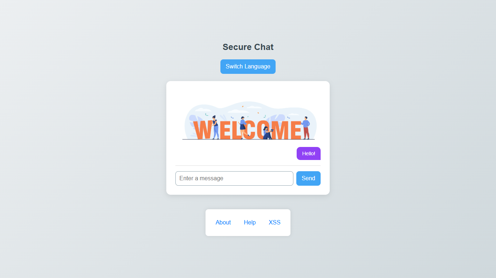
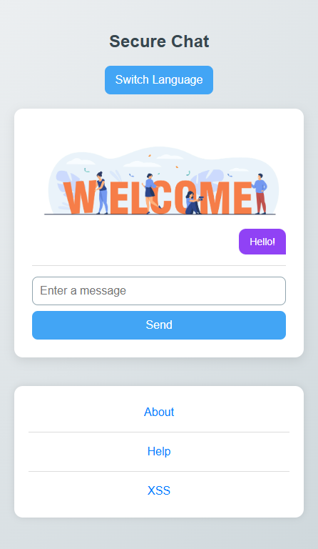
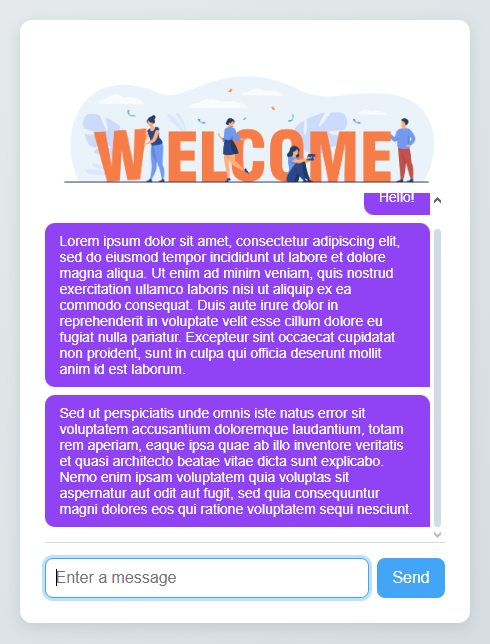

## 1. Клонируйте [*репо*][1]

## 2. Проверьте все возможные недочёты:
### HTML:

* **Ссылки** - Все ссылки должны корректно открываться

* **Мультиязычность** - Проверить все страницы на корректность переведенного текста

### JS:
* **Принцип CRUD** - Проверьте, что все операции CRUD (создание, чтение, ~~изменение~~, ~~удаление~~) работают корректно.

* **Базовые функции** - Вызвать функцию рендера LS чтобы после обновления страницы пользователь не терял историю сообщений

* **Поле ввода:**

 * Добавьте валидацию для поля ввода, чтобы предотвратить отправку пустых сообщений или сообщений, состоящих только из пробелов.

 * Экранируйте поле ввода используя textContent, чтобы избежать XSS-уязвимостей.

 * Добавь в <head> страницы мета-тег запрета выполнения сторонних скриптов

 * Добавьте возможность отправлять сообщение из поля input, путём нажатия клавиши “Enter” — [тык][3]

### CSS:
* **Адаптивность** - Корректрые изменения на компьюторе и мобильном телефоне (768px)

## 3. Протестируйте вашу версию на работоспособность и сверьте с скринами ниже

|main page(PC)|Main page(mobile)|Chat window|
|-------------|-----------------|-----------|
||||

[1]:https://github.com/agkondakov91/PR-intro-web-testing "Команда git clone"
[2]:https://autoprefixer.github.io/ru/
[3]:https://sky.pro/wiki/html/kak-aktivirovat-knopku-html-pri-nazhatii-enter-java-script/